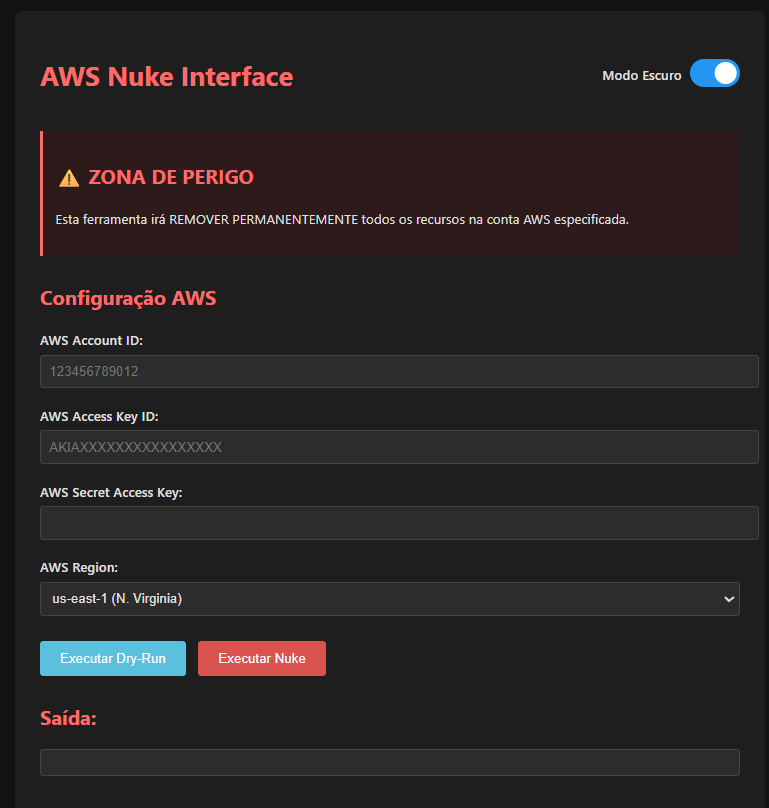

# 🚀 AWS Resource Cleaner



Uma interface web moderna e segura para limpar todos os recursos de uma conta AWS sem precisar de alias da conta. A aplicação usa apenas o Account ID e credenciais AWS fornecidas temporariamente.

## 🔒 **IMPORTANTE: SEGURANÇA E PRIVACIDADE**

### ❌ **ESTA APLICAÇÃO NÃO ARMAZENA CREDENCIAIS**

**Esta aplicação é completamente segura em relação ao armazenamento de credenciais:**

- ✅ **Não salva credenciais em arquivos**
- ✅ **Não armazena credenciais em banco de dados**
- ✅ **Não mantém credenciais em memória após o uso**
- ✅ **Não envia credenciais para serviços externos**
- ✅ **Não faz log das credenciais**

### 🔍 **Como as Credenciais são Tratadas:**

```python
# ✅ SEGURO: Credenciais são usadas apenas temporariamente
env = os.environ.copy()
env.update({
    'AWS_ACCESS_KEY_ID': data['aws_access_key'],      # Usado apenas na execução
    'AWS_SECRET_ACCESS_KEY': data['aws_secret_key'],  # Não é salvo em lugar algum
    'AWS_DEFAULT_REGION': data['region']              # Descartado após o uso
})

# ✅ SEGURO: Processo filho usa as credenciais e termina
result = subprocess.run([script], env=env, ...)

# ✅ SEGURO: Variáveis são automaticamente descartadas
# Não há persistência de dados sensíveis
```

### 🛡️ **Exemplo de Uso Seguro:**

```bash
# 1. Você insere as credenciais na interface web
Account ID: 123456789012
Access Key: AKIA...
Secret Key: wJalr...
Region: us-east-1

# 2. A aplicação usa as credenciais APENAS para:
#    - Conectar na AWS
#    - Listar recursos
#    - Executar ações (se solicitado)

# 3. Após a execução:
#    - Credenciais são descartadas da memória
#    - Nenhum arquivo é criado com credenciais
#    - Processo termina sem rastros
```

---

## 🌟 **Principais Recursos**

### ✅ **Limpeza Completa de Recursos**
- Deleta todos os recursos da conta AWS
- Não exige alias da conta (diferente do AWS Nuke original)
- Funciona apenas com Account ID + credenciais AWS

### ✅ **Interface Amigável**
- Interface web moderna e intuitiva
- Modo escuro/claro com alternância
- Visualização em tempo real do progresso
- Feedback detalhado das operações

### ✅ **Validações de Segurança**
- Validação de formato do Account ID (12 dígitos)
- Validação de formato da AWS Access Key (AKIA...)
- Validação de tamanho da Secret Key (40 caracteres)
- Confirmação obrigatória antes da execução

### ✅ **Tratamento de Erros Robusto**
- Timeouts configurados (5min dry-run, 30min execução)
- Limpeza automática de arquivos temporários
- Mensagens de erro claras e detalhadas
- Logs estruturados para debugging

---

## 📁 **Estrutura do Projeto**

```
nuke/
├── 📄 README.md                    # Este arquivo
├── 📄 LICENSE                      # Licença MIT
├── 📄 .gitignore                   # Arquivos ignorados pelo Git
├── 🖼️  imgs/                        # Imagens e logos
├── 📁 src-app/                     # Aplicação Flask principal
│   ├── 🐍 app.py                   # Aplicação web principal
│   ├── 🐍 aws_resource_cleaner_simple.py  # Script de limpeza
│   ├── 📄 requirements.txt         # Dependências Python
│   ├── 📁 templates/               # Templates HTML
│   │   └── 🌐 index.html          # Interface principal
│   └── 📁 static/                  # CSS, JS, imagens
│       ├── 🎨 style.css           # Estilos principais
│       └── ⚡ script.js           # JavaScript da interface
├── 📁 src-nuke/                    # Binários e scripts auxiliares
│   ├── 🔧 aws-nuke-v2.25.0-linux-amd64  # Binário AWS Nuke (backup)
│   ├── 🔧 aws-nuke-wrapper.sh     # Script wrapper (backup)
│   └── 📄 nuke-config.yml         # Configuração exemplo
├── 📁 tests/                       # Scripts de teste
│   ├── 🧪 test_app.py             # Testes da aplicação
│   └── 🧪 test_config.py          # Testes de configuração
├── 📁 examples/                    # Exemplos de uso
│   └── 📝 exemplo_sem_filtros.py  # Exemplo de configuração
└── 📁 docs/                        # Documentação adicional
```

---

## 🚀 **Como Usar**

### 1️⃣ **Instalar Dependências**
```bash
cd src-app
pip install -r requirements.txt
```

### 2️⃣ **Executar a Aplicação**
```bash
python app.py
```

### 3️⃣ **Acessar Interface**
- Abra http://localhost:5000
- Preencha os campos obrigatórios:

```
┌─────────────────────────────────────┐
│ 🔐 Credenciais AWS (Temporárias)    │
├─────────────────────────────────────┤
│ Account ID: [123456789012]          │
│ Access Key: [AKIA................]  │
│ Secret Key: [........................] │
│ Região:     [us-east-1 ▼]          │
└─────────────────────────────────────┘
```

### 4️⃣ **Testar Primeiro (RECOMENDADO)**
```bash
# Clique em "🔍 Executar Dry-Run"
# Analise a saída antes de executar
```

**Exemplo de saída do Dry-Run:**
```
============================================================
🔍 DRY RUN MODE
Account ID: 123456789012
Region: us-east-1
============================================================

🔍 Checking EC2 Resources...
  📦 Found 3 EC2 instances
    🔍 Would terminate EC2 instance: i-1234567890abcdef0 (state: running)
    🔍 Would terminate EC2 instance: i-0987654321fedcba0 (state: stopped)
  💾 Found 2 available EBS volumes
    🔍 Would delete EBS volume: vol-1234567890abcdef0
    🔍 Would delete EBS volume: vol-0987654321fedcba0

🔍 Checking S3 Buckets...
  🪣 Found 1 S3 buckets
    🔍 Would delete S3 bucket: my-test-bucket

🔍 Checking RDS Instances...
  🗄️  Found 1 RDS instances
    🔍 Would delete RDS instance: my-database (status: available)

============================================================
📊 SUMMARY:
Total resources found: 7
🔍 This was a DRY RUN - no resources were actually deleted
💡 Use --no-dry-run flag to actually delete resources
============================================================
```

### 5️⃣ **Executar (CUIDADO!)**
```bash
# Clique em "🚨 Executar Nuke" apenas se tiver certeza
# Confirme na caixa de diálogo
```

---

## 🛡️ **Recursos Suportados**

A aplicação pode limpar os seguintes tipos de recursos AWS:

| Serviço | Recursos | Status |
|---------|----------|--------|
| **EC2** | Instances, EBS Volumes, Snapshots, Security Groups | ✅ |
| **S3** | Buckets e Objects | ✅ |
| **RDS** | DB Instances | ✅ |
| **Lambda** | Functions | ✅ |
| **DynamoDB** | Tables | ✅ |
| **CloudFormation** | Stacks | ✅ |
| **IAM** | Users, Roles, Policies (com proteções) | ✅ |
| **Elastic Beanstalk** | Applications e Environments | ✅ |

### 🔒 **Recursos Protegidos por Padrão**

Por segurança, alguns recursos críticos são protegidos:

- ✅ **Security Group "default"** - Não é deletado
- ✅ **IAM Role "OrganizationAccountAccessRole"** - Preservado
- ✅ **Usuário IAM atual** - Não é removido
- ✅ **Recursos "in-use"** - EBS volumes em uso são preservados

---

## 🌐 **Endpoints da API**

| Endpoint | Método | Descrição |
|----------|--------|-----------|
| `/` | GET | Interface web principal |
| `/api/dry-run` | POST | Executa simulação (dry-run) |
| `/api/execute` | POST | Executa limpeza real |
| `/api/health` | GET | Verifica status da aplicação |

### 📝 **Exemplo de Requisição API:**

```bash
# Dry-run via API
curl -X POST http://localhost:5000/api/dry-run \
  -H "Content-Type: application/json" \
  -d '{
    "account_id": "123456789012",
    "aws_access_key": "AKIA...",
    "aws_secret_key": "wJalr...",
    "region": "us-east-1"
  }'
```

---

## ⚠️ **AVISOS DE SEGURANÇA**

### 🚨 **ATENÇÃO: Esta ferramenta pode deletar TODOS os recursos da conta AWS!**

- ✅ **Sempre execute dry-run primeiro**
- ✅ **Mantenha backups importantes**
- ✅ **Use em contas de teste/desenvolvimento**
- ❌ **Nunca use em produção sem extremo cuidado**
- ❌ **Não compartilhe credenciais AWS**

### 🔐 **Boas Práticas de Segurança:**

1. **Use credenciais temporárias quando possível**
2. **Crie um usuário IAM específico para limpeza**
3. **Configure políticas IAM restritivas**
4. **Execute sempre em ambiente controlado**
5. **Monitore logs de auditoria AWS CloudTrail**

### 📋 **Exemplo de Política IAM Restritiva:**

```json
{
  "Version": "2012-10-17",
  "Statement": [
    {
      "Effect": "Allow",
      "Action": [
        "ec2:*",
        "s3:*",
        "rds:*",
        "lambda:*",
        "dynamodb:*",
        "cloudformation:*"
      ],
      "Resource": "*",
      "Condition": {
        "StringEquals": {
          "aws:RequestedRegion": ["us-east-1", "sa-east-1"]
        }
      }
    }
  ]
}
```

---

## 🧪 **Testes**

### Executar Testes Automatizados:
```bash
cd tests
python test_app.py
```

### Testar Health Check:
```bash
curl http://localhost:5000/api/health
```

---

## 🐛 **Logs e Debug**

Para ver logs detalhados:

```bash
# Executar com debug habilitado
python app.py

# Logs aparecerão no terminal:
# [2025-06-18 14:30:15] INFO: Iniciando aplicação...
# [2025-06-18 14:30:16] INFO: Servidor rodando em http://0.0.0.0:5000
```

---

## 🤝 **Contribuição**

1. Fork o projeto
2. Crie uma branch para sua feature (`git checkout -b feature/AmazingFeature`)
3. Commit suas mudanças (`git commit -m 'Add some AmazingFeature'`)
4. Push para a branch (`git push origin feature/AmazingFeature`)
5. Abra um Pull Request

---

## 📄 **Licença**

Este projeto está licenciado sob a Licença MIT - veja o arquivo [LICENSE](LICENSE) para detalhes.

---

## 🆘 **Suporte**

Se você encontrar problemas ou tiver dúvidas:

1. **Verifique os logs** da aplicação
2. **Execute o health check** (`/api/health`)
3. **Teste com dry-run** primeiro
4. **Verifique as credenciais AWS**
5. **Consulte a documentação** da AWS

---

## 🔄 **Changelog**

### v1.0.0 (2025-06-18)
- ✅ Interface web com modo escuro/claro
- ✅ AWS Resource Cleaner personalizado
- ✅ Validação de credenciais AWS
- ✅ Dry-run e execução real
- ✅ Não armazenamento de credenciais
- ✅ Documentação completa

---

**⚡ Desenvolvido com segurança e eficiência em mente!**
