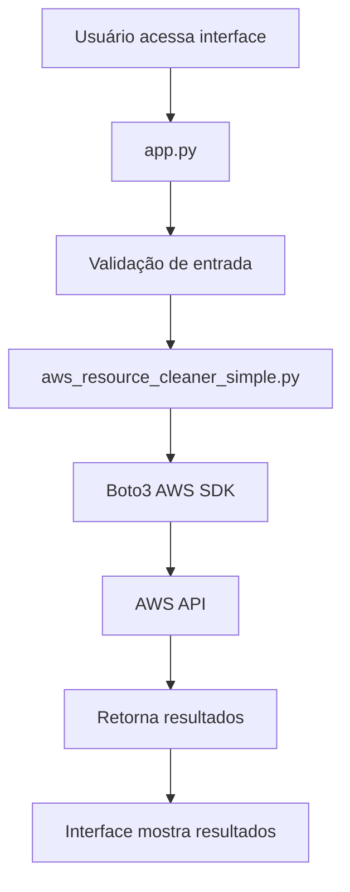

# 📁 Estrutura do Projeto

## Visão Geral

```
nuke/
├── 📄 README.md                    # Documentação principal
├── 📄 LICENSE                      # Licença MIT
├── 📄 .gitignore                   # Arquivos ignorados pelo Git
├── 🖼️  imgs/                        # Imagens e logos
│   └── 📸 app.png                  # Screenshot da aplicação
├── 📁 src-app/                     # Aplicação Flask principal
│   ├── 🐍 app.py                   # Aplicação web principal
│   ├── 🐍 aws_resource_cleaner_simple.py  # Script de limpeza otimizado
│   ├── 🐍 aws_resource_cleaner.py  # Script de limpeza original
│   ├── 📄 requirements.txt         # Dependências Python
│   ├── 📁 templates/               # Templates HTML
│   │   └── 🌐 index.html          # Interface principal
│   └── 📁 static/                  # CSS, JS, imagens
│       └── 🎨 style.css           # Estilos principais
├── 📁 src-nuke/                    # Binários e scripts auxiliares
│   ├── 🔧 aws-nuke-v2.25.0-linux-amd64  # Binário AWS Nuke (backup)
│   ├── 📦 aws-nuke-v2.25.0-linux-amd64.tar.gz  # Arquivo original
│   ├── 🔧 aws-nuke-wrapper.sh     # Script wrapper (backup)
│   └── 📄 nuke-config.yml         # Configuração exemplo
├── 📁 tests/                       # Scripts de teste
│   ├── 🧪 test_app.py             # Testes da aplicação
│   └── 🧪 test_config.py          # Testes de configuração
├── 📁 examples/                    # Exemplos de uso
│   ├── 📝 exemplo_sem_filtros.py  # Exemplo de configuração
│   └── 📝 exemplo_uso_api.py      # Exemplo de uso da API
└── 📁 docs/                        # Documentação adicional
    ├── 📋 INSTALLATION.md          # Guia de instalação
    ├── 🔒 SECURITY.md              # Documentação de segurança
    └── 📁 STRUCTURE.md             # Este arquivo
```

## Descrição dos Arquivos

### 📁 Diretório Raiz

| Arquivo | Descrição |
|---------|-----------|
| `README.md` | Documentação principal com instruções de uso |
| `LICENSE` | Licença MIT do projeto |
| `.gitignore` | Lista de arquivos/diretórios ignorados pelo Git |

### 📁 src-app/ - Aplicação Principal

| Arquivo | Descrição |
|---------|-----------|
| `app.py` | Aplicação Flask principal com endpoints da API |
| `aws_resource_cleaner_simple.py` | Script otimizado para limpeza de recursos AWS |
| `aws_resource_cleaner.py` | Script original (mantido para compatibilidade) |
| `requirements.txt` | Lista de dependências Python necessárias |
| `templates/index.html` | Interface web principal |
| `static/style.css` | Estilos CSS da interface |

### 📁 src-nuke/ - Binários e Scripts

| Arquivo | Descrição |
|---------|-----------|
| `aws-nuke-v2.25.0-linux-amd64` | Binário original do AWS Nuke (backup) |
| `aws-nuke-v2.25.0-linux-amd64.tar.gz` | Arquivo compactado original |
| `aws-nuke-wrapper.sh` | Script wrapper para contornar limitações |
| `nuke-config.yml` | Exemplo de configuração do AWS Nuke |

### 📁 tests/ - Testes

| Arquivo | Descrição |
|---------|-----------|
| `test_app.py` | Testes automatizados da aplicação |
| `test_config.py` | Testes de configuração |

### 📁 examples/ - Exemplos

| Arquivo | Descrição |
|---------|-----------|
| `exemplo_sem_filtros.py` | Exemplo de configuração sem filtros |
| `exemplo_uso_api.py` | Exemplo de uso da API via Python |

### 📁 docs/ - Documentação

| Arquivo | Descrição |
|---------|-----------|
| `INSTALLATION.md` | Guia detalhado de instalação |
| `SECURITY.md` | Documentação sobre segurança e credenciais |
| `STRUCTURE.md` | Este arquivo - estrutura do projeto |

### 📁 imgs/ - Imagens

| Arquivo | Descrição |
|---------|-----------|
| `app.png` | Screenshot da interface da aplicação |

## Fluxo de Execução



## Arquivos de Configuração

### requirements.txt
```
flask>=2.0.0
pyyaml>=5.0.0
boto3>=1.26.0
botocore>=1.29.0
```

### .gitignore (principais exclusões)
```
# Credenciais AWS
*.pem
*.key
.aws/
credentials.json

# Python
__pycache__/
*.pyc

# Logs
*.log

# Temporários
*.tmp
/tmp/
```

## Permissões Recomendadas

```bash
# Aplicação principal
chmod 755 src-app/
chmod 644 src-app/*.py
chmod +x src-app/aws_resource_cleaner_simple.py

# Scripts auxiliares
chmod +x src-nuke/aws-nuke-wrapper.sh
chmod +x src-nuke/aws-nuke-v2.25.0-linux-amd64

# Testes
chmod +x tests/test_app.py

# Documentação (somente leitura)
chmod 644 docs/*.md
chmod 644 README.md
```

## Tamanhos dos Arquivos

| Tipo | Tamanho Aproximado |
|------|-------------------|
| Binário AWS Nuke | ~143 MB |
| Scripts Python | ~50 KB |
| Templates HTML/CSS | ~20 KB |
| Documentação | ~30 KB |
| **Total** | **~143 MB** |

## Dependências Externas

### Python (Runtime)
- Python 3.8+
- pip (gerenciador de pacotes)

### Bibliotecas Python
- Flask (framework web)
- Boto3 (SDK AWS)
- PyYAML (parser YAML)
- Botocore (core do Boto3)

### Opcionais
- AWS CLI (para testes)
- curl (para testes de API)

---

**📋 Estrutura organizada para máxima clareza e manutenibilidade!**
